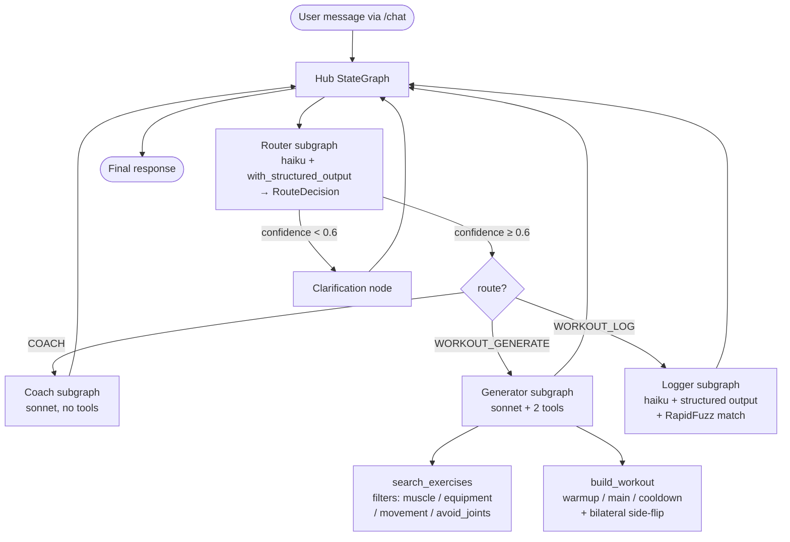

# Spotter — LangGraph Multi-Agent Fitness System

A LangGraph hub agent that routes user requests across three intents — coach a movement, generate a workout, log a workout — to specialized sub-agents backed by Anthropic Claude and a 50-exercise dataset. Built for the [Future Research AI Engineer take-home](https://github.com/future-research/candidate-assessment/blob/main/1-multi-agent/ASSESSMENT.md).

**Live demo:** https://spotter-production-e724.up.railway.app

**Walkthrough video:** https://www.youtube.com/watch?v=hkPhCSb-Q6c

## Quick start

```bash
git clone https://github.com/melmallow/spotter.git && cd spotter
cp .env.example .env             # then put your ANTHROPIC_API_KEY in .env
uv sync --extra dev
uv run python -m spotter   # serves http://127.0.0.1:8000
```

Then open the URL and try the chips below the chat input — one prompt per route.

## Run the tests

```bash
uv run pytest -v
```

26 deterministic tests across 8 files, no real API calls. Two of those files are the assessment's required "critical paths" — `test_router_clarification.py` (low-confidence routing → clarification, never silent misroute) and `test_generator_empty_search.py` (empty-search recovery, `avoid_joints` injury filter, bilateral side-flip). See `tests/README.md` for why those two carry the most weight. The other six files cover multi-turn conversation threading and disambiguation resume (`test_multiturn_disambiguation.py`, `test_conversation_threading.py`, `test_conversations.py`), the logger's movement-keyword candidate-pool bias (`test_logger_movement_bias.py`), and the coach + clarification subgraphs (`test_coach.py`, `test_clarification.py`).

## Run the evals

```bash
uv run python -m spotter.evals --suite routing   # ~$0.10 of haiku spend
uv run python -m spotter.evals --suite all       # ~$0.50 full sweep
```

See `evals/README.md` for what each suite measures and where to record the baseline numbers. The eval suite hits real Claude — `tests/` does not.

## Observability

Every request emits structured JSON to `logs/trace.jsonl` and stdout, tagged with a per-request `trace_id` so a single user message can be walked end-to-end across the hub, router, sub-agents, and tools. Built on `structlog` + `contextvars` (one config in `src/spotter/logging_setup.py`); propagates cleanly across async sub-graph calls without per-call plumbing. `logs/` is gitignored — populate it by running `uv run pytest` or sending any request through the demo.

Sample — a routing decision:

```json
{"event": "routed", "route": "WORKOUT_LOG", "confidence": 0.95, "clarification_needed": false, "latency_ms": 1129, "success": true, "trace_id": "req-6ac153e3c868", "conversation_id": "conv-...", "level": "info", "timestamp": "2026-06-03T04:27:17Z"}
```

Ten event types instrument the full call graph; fields beyond `trace_id` / `timestamp` / `level`:

| Event | Fields |
|---|---|
| `hub_request` | `user_input`, `conversation_id` |
| `routed` | `route`, `confidence`, `clarification_needed`, `latency_ms`, `success`, `error_class` |
| `agent_step` | `has_tool_calls`, `latency_ms`, `success` |
| `tool_call` | `tool_name`, `result_size`, `empty_reason`, `success`, `error_class` |
| `log_extracted` | `sets`, `reps`, `latency_ms`, `success`, `error_class` |
| `log_matched` | `exercise_id`, `matched`, `top_score`, `candidates`, `movement_keyword`, `pool_size` |
| `coach_answered` | `length`, `latency_ms`, `success` |
| `clarification_emitted` | `offered` |
| `hub_response` | `route`, `confidence`, `clarification_needed`, `latency_ms` |
| `hub_error` | `error`, `error_class`, `latency_ms` |

Queryable with `jq` — three useful examples (`fromjson?` skips any non-structlog stdlib lines):

```bash
# walk a single request
jq -R 'fromjson? | select(.trace_id=="req-6ac153e3c868")' logs/trace.jsonl

# tool-call failures vs total
jq -Rn '[inputs | fromjson? | select(.event=="tool_call")] | "\(map(select(.success==false)) | length) failures out of \(length)"' logs/trace.jsonl

# mean latency per route
jq -Rr 'fromjson? | select(.event=="hub_response") | "\(.route) \(.latency_ms)"' logs/trace.jsonl \
  | awk '{s[$1]+=$2; n[$1]++} END {for (r in n) printf "%-18s mean=%dms (n=%d)\n", r, s[r]/n[r], n[r]}'
```

No external backend wired — Langfuse or OpenTelemetry exporters are v2 work that would slot in alongside the existing structlog config.

## Architecture



**The hub** is a typed `StateGraph` whose nodes are compiled subgraphs (not inlined functions), wired with explicit edges and a single conditional edge from the router. Each sub-agent owns its own graph and is composed into the hub via `add_node(name, compiled_subgraph)`. State carries a `messages: list[BaseMessage]` channel with LangGraph's `add_messages` reducer, so every turn appends to the conversation rather than overwriting it.

**Multi-turn memory.** The web app compiles the hub with a `MemorySaver` checkpointer; each `/chat` request passes the client's `conversation_id` as LangGraph's `thread_id`, which rehydrates prior turns from the checkpointer before invoking the graph. Sub-agents read `state["messages"]`, trim to the last `MAX_HISTORY_TURNS=8` turns via `spotter.conversations.trim_history` (drops a leading orphan AIMessage so the trimmed list always starts with a HumanMessage), and pass the window to the LLM. Storage is in-process — restart drops history; durable session storage is v2 work.

**The router** uses Claude haiku with `with_structured_output(RouteDecision)` to classify intent and self-report confidence in `[0, 1]`. When confidence < 0.6 or the route is `UNKNOWN`, the graph routes to a clarification node that names the two most likely routes. Routing errors fall back to clarification, never to silent misroute.

**The workout generator** is a tool-calling agent over two Pydantic-bound tools. `search_exercises` filters by muscle group, equipment, movement pattern, and an optional `avoid_joints` exclusion (the injury filter). `build_workout` resolves selected exercise IDs into warmup / main / cooldown blocks with sets, reps, and rest; for any selected exercise marked `is_bilateral=True`, the tool auto-appends a second `(other side)` set of the same record. (The dataset's `bilateral_pair_id` values do not resolve to real records, so we use the same record with a flipped side label rather than synthesizing a virtual pair.)

**The workout logger** runs Claude haiku with `with_structured_output(LogEntry)` to extract sets / reps / weight / unit plus a `movement_keyword` (e.g. `row`, `press`, `curl`, `deadlift`) that names the dominant pattern. If the keyword has any hits in the dataset, fuzzy matching runs against that filtered pool instead of the full 50 records — this stops WRatio from over-weighting an equipment token like "Dumbbell" and steering "dumbbell rows" to "Alternating Dumbbell Decline Bench Press". An empty bias pool falls back to the full dataset. Matches above `FUZZY_MATCH_THRESHOLD=75` return a resolved log; below threshold, the top-3 candidates surface as a disambiguation question — and because the trimmed conversation is passed to the next extraction, when the user replies with a candidate name the logger merges the prior turn's sets/reps/weight with the chosen exercise instead of starting over.

**The coach** is a single sonnet call with a scope-guard prompt that names what it covers (exercises, anatomy, programming concepts) and redirects off-topic asks back to fitness.

**Observability** is structured-JSON tracing via `structlog` + `contextvars` — the FastAPI middleware binds a fresh `trace_id` per request and propagates it across async sub-graph calls. Sample line, event schema, and `jq` queries are in the [Observability](#observability) section above.

**The web app** is a single FastAPI route at `POST /chat` plus a static dashboard at `GET /`. The dashboard renders a left nav rail, a greeting + (placeholder) stats row, three quick-action chips (one per route), a side-by-side `My workouts` / `Recent logs` layout with pagination and per-log delete, and a right-hand chat panel. The chat panel binds a fresh `conversation_id = crypto.randomUUID()` on page load and sends it with every request; the injury chips above the composer feed `avoid_joints` into `WORKOUT_GENERATE`, and successful `WORKOUT_LOG` responses append to Recent Logs from the structured `log_entry` field of the `/chat` JSON. Tailwind is loaded via CDN so the reviewer can open the page with no build step.

## Example transcripts

> **User:** What muscles does a Romanian deadlift work?
>
> **Coach** (sonnet, no tools) → "RDLs primarily load the posterior chain — hamstrings, glutes, and the erectors as bracers. The movement is a hip hinge; the knees stay relatively static while the hips drive back. Lats engage isometrically to keep the bar tight to the body."

> **User:** Build me a 30-minute upper body workout with dumbbells
>
> **Generator** (sonnet, tool-calling) → calls `search_exercises(muscle_groups=['chest','triceps','deltoids','lats'], equipment=['Dumbbell'])`, picks 4 exercises, calls `build_workout(...)`, returns:
> ```
> WARMUP
> - 2x10 Push-Up to Knee-Drive (rest 30s)
> MAIN
> - 4x8 Dumbbell Neutral-Grip Bench Press (rest 90s)
> - 3x10 Dumbbell Incline Chest Fly (rest 60s)
> - 3x12 Single-Arm Dumbbell Row (left arm, rest 45s)
> - 3x12 Single-Arm Dumbbell Row (right arm, rest 45s)
> COOLDOWN
> - 2x30s Kneeling Stability Ball Lat Stretch (rest 0s)
> ```

> **User:** I just did 3x10 bench press at 185 lbs
>
> **Logger** (haiku + WRatio over the `press` keyword pool) → "Logged: 3x10 Barbell Flat Bench Press at 185 lbs." (Match score and all three candidates land in `logs/trace.jsonl` under `event=log_matched`.)

> **User:** Bench press
>
> **Router → Clarification** → "I'm not sure what you meant — would you like me to build you a workout or log a workout you just finished? A bit more detail will help me route correctly."

> **User (turn 1):** 4x6 rows at 95 lbs
> **Logger** → "I couldn't confidently match 'rows'. Did you mean one of: 'Bent-Over Barbell Row', 'Single-Arm Dumbbell Row', 'Seated Cable Row'?"
> **User (turn 2):** the cable one
> **Logger** (rehydrated history → merge prior sets/reps/weight with chosen exercise) → "Logged: 4x6 Seated Cable Row at 95 lbs."

## Design decisions

| Decision | Why |
|---|---|
| Anthropic Claude tier split (haiku / sonnet) | Haiku is fast and cheap for structured-output classification (router, log extraction); sonnet quality dominates for generation (coach, workout tool-calling). |
| `with_structured_output(RouteDecision)` carries confidence as a Pydantic field | langchain-anthropic doesn't return confidence natively; making the LLM self-report it inside the schema costs zero infrastructure. |
| Clarification path, not silent fallback | The PRD called for the decision to be explicit. Surfacing uncertainty preserves the user's trust. |
| Sub-agents as separate `StateGraph` subgraphs | The PRD called for this. It also makes each agent unit-testable in isolation. |
| FastAPI single-page + Tailwind via CDN | "Simple web view is fine" per PRD; CDN avoids a build step so the reviewer can open the page immediately. |
| RapidFuzz `WRatio` for exercise-name match | `token_set_ratio` scored too low against full canonical names ("bench press" vs "Barbell Flat Bench Press"); WRatio combines strategies and handles partial substring matches. |
| Movement-keyword candidate pool in the logger | Filters the 50-record dataset down to a keyword pool (`row`, `press`, `curl`, …) before WRatio runs. Eliminates the WRatio over-weighting failure mode (e.g. "dumbbell rows" → "Alternating Dumbbell Decline Bench Press"). Falls back to the full dataset if the pool is empty. |
| Bilateral side-flip inside `build_workout` | Dataset's `bilateral_pair_id` values do not resolve to real records. Flipping a side label on the same record satisfies the requirement without inventing IDs. |
| LangGraph `MemorySaver` keyed by `conversation_id` (= `thread_id`) | Lets the assessment's stretch goal (multi-turn memory) land with one composable line — `build_hub(checkpointer=MemorySaver())` — and propagates the conversation through every sub-agent via the existing `messages` channel. In-process only by design for v1. |
| `structlog` with `contextvars` for `trace_id` | One global config, cleanly propagates across async sub-graph calls — `RunnableConfig` callbacks would be more code for the same effect. |
| `uv` + `pyproject.toml` + `src/` layout | Fast install for the reviewer, modern Python defaults. |

## Known limits

- No streaming responses — `/chat` returns one JSON payload.
- Multi-turn memory is **in-process only** — `MemorySaver` lives in the FastAPI process, so a restart drops every conversation. Durable per-user history (Postgres, Redis) is v2.
- No Langfuse or OpenTelemetry — observability is `structlog` only.
- No authentication or rate limiting.
- Dashboard stats (day streak, weekly sessions, volume) and the "30-min push focus" workout card are static placeholders in `index.html` — the only live wiring is the chat panel, the injury chips that feed `WORKOUT_GENERATE`, and the Recent Logs list (populated from `WORKOUT_LOG` responses with client-side per-log delete).
- Coach responses about exercises NOT in the 50-record dataset use Claude's general knowledge; the scope-guard prompt nudges the model toward fitness, but factuality is best-effort.

## How I would evaluate this system in production

The starting point is `evals/`. It runs today against real Claude and reports concrete numbers — routing accuracy, ambiguous-input clarification recall, empty-search recovery rate (UUID-presence + acknowledgement check), and an LLM-as-judge score for COACH responses on factuality, scope adherence, and tone. That's the working artifact. Production hardening would layer the following on top.

**Routing accuracy.** The labeled set in `evals/data/routing.jsonl` is the starting test bed. In production, I'd grow it continuously from sampled live traffic (anonymized) and human-labeled corrections. Target: ≥ 95% accuracy on the rolling set, with a confidence-calibration plot (predicted confidence vs. observed correctness) reviewed weekly. The eval currently reports `mean_confidence_on_correct` vs `mean_confidence_on_wrong` as a single-number calibration sanity check; the plot is v2.

**Tool-call validity.** The empty-search suite checks for fabricated UUIDs. In production I'd extend this to a per-route counter on `logs/trace.jsonl`: `count(tool_call where success=false) / count(tool_call)`. Alert if the rate climbs above 1%. This is the cheapest tripwire for prompt regressions in the tool-calling flow.

**Empty-search rate as a coverage signal.** Today the eval intentionally probes 5 unavailable-equipment cases. In production, the empty-search rate from real traffic is a coverage signal: when it climbs in a particular muscle / equipment combination, the dataset has a gap users care about. This drives dataset expansion priorities.

**Latency.** Per-request `latency_ms` already lives in `logs/trace.jsonl`. Production needs an aggregator that emits p50 and p95 per route, plus a dashboard. Targets I'd set initially: COACH p95 < 3s, WORKOUT_LOG p95 < 2s (cheap), WORKOUT_GENERATE p95 < 8s (tool loop dominates).

**Hallucination spot-checks for COACH.** The `coach` suite already runs an LLM-as-judge against reference facts and scores three axes. Production would sample live COACH responses on a cadence (e.g., 1% of requests) and run the same judge with anonymized context. A drift in `mean_factuality` triggers a prompt review.

**Failure-mode catalog grepable from `logs/trace.jsonl`.** Every error class lands in the structured log with `event=hub_error|validation_error|tool_call success=false`. Searching for those events surfaces the failure population. A weekly report `jq 'select(.event=="hub_error")' logs/trace.jsonl | sort | uniq -c` (or equivalent in a real log pipeline) is the starting tripwire.

What the system would lose under traffic that v1 doesn't address: durable per-user persistence (today's `MemorySaver` lives in-process and drops on restart), rate-limiting per IP, authentication, and a proper observability backend (Langfuse, OpenTelemetry, or equivalent). These are explicit v2 work — they're called out in the brainstorm's Scope Boundaries.

## Repo layout

```
spotter/
├── exercises.json                       # 50-exercise dataset (provided)
├── pyproject.toml
├── src/spotter/
│   ├── __main__.py                      # launches the FastAPI demo
│   ├── config.py                        # env vars + thresholds (CONFIDENCE, FUZZY, MAX_HISTORY_TURNS)
│   ├── data.py                          # dataset loader + indexes
│   ├── schemas.py                       # HubState + structured-output models
│   ├── llm.py                           # Anthropic factory (haiku|sonnet)
│   ├── logging_setup.py                 # structlog + contextvars
│   ├── conversations.py                 # trim_history — last-N-turns window with orphan-AI drop
│   ├── hub.py                           # hub StateGraph + run_hub (passes thread_id = conversation_id)
│   ├── agents/
│   │   ├── router.py
│   │   ├── clarification.py
│   │   ├── coach.py
│   │   ├── logger.py                    # haiku + LogEntry + movement-keyword candidate pool
│   │   └── generator.py
│   ├── tools/
│   │   ├── search_exercises.py
│   │   └── build_workout.py
│   ├── web/
│   │   ├── app.py                       # FastAPI + /chat (MemorySaver checkpointer)
│   │   ├── __main__.py                  # uvicorn entrypoint
│   │   ├── static/                      # category images, favicon
│   │   └── templates/index.html         # dashboard + chat + injury chips
│   └── evals/
│       ├── __main__.py                  # CLI: --suite routing|ambiguous|unavailable_equipment|coach|all
│       ├── runner.py
│       ├── metrics.py
│       └── judge.py
├── tests/                               # 26 tests, all mocked (no real Claude calls)
│   ├── README.md                        # why test_router_clarification + test_generator_empty_search
│   ├── conftest.py                      # FakeStructuredChatModel wrapper
│   ├── test_router_clarification.py     # critical path #1 (5 tests)
│   ├── test_generator_empty_search.py   # critical path #2 (5 tests)
│   ├── test_conversations.py            # trim_history correctness (6 tests)
│   ├── test_conversation_threading.py   # MemorySaver isolation by conversation_id (2 tests)
│   ├── test_multiturn_disambiguation.py # logger merges sets/reps from prior turn (3 tests)
│   ├── test_logger_movement_bias.py     # keyword pool bias + fallback (3 tests)
│   ├── test_coach.py                    # coach reads history, returns AIMessage (1 test)
│   └── test_clarification.py            # clarification node returns AIMessage (1 test)
├── evals/
│   ├── README.md
│   ├── data/                            # labeled prompt sets: routing, ambiguous, unavailable_equipment, coach
│   └── results/                         # gitignored — runner output
├── logs/                                # gitignored — trace.jsonl
└── docs/
    ├── brainstorms/                     # requirements docs (initial + multi-turn + my-workouts + render cleanup)
    └── plans/                           # implementation plans (initial + multi-turn + render cleanup)
```

The `docs/brainstorms/` and `docs/plans/` markdown files are the requirements + implementation plans I wrote before each chunk of work; they're checked in to make the engineering process visible to reviewers.

## License

MIT — see `LICENSE`.
