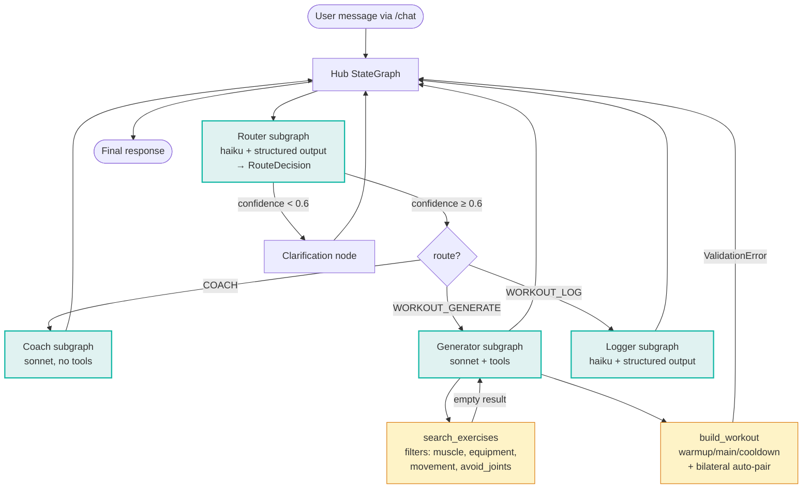

# feat: Future Fitness Multi-Agent System

## Summary

Build a LangGraph hub agent routing fitness messages across three intents (`COACH`, `WORKOUT_GENERATE`, `WORKOUT_LOG`) to three composed sub-agent subgraphs, backed by a 50-exercise dataset, Anthropic Claude (haiku for routing + log extraction, sonnet for coaching + workout generation), structured-logging observability, automatic bilateral-exercise pairing, and joints-loaded injury filtering. The system ships as a public greenfield Python repo at `/Users/melissahargis/fitness/` with a FastAPI single-page demo styled to Future.co's brand, two pytest critical-path tests, and a README covering setup, architecture, transcripts, and a dedicated production-evaluation section.

---

## Problem Frame

The Future Research AI Engineer take-home asks a candidate to demonstrate composition of a small but correct multi-agent system: typed LangGraph state, separated sub-agents, schema-bound tools, LLM-driven structured output for routing, graceful resilience on ambiguous input and empty tool results, and clear production-thinking in the README. The reviewer reads the repo, runs the demo, runs the tests, and reads the README — these are the four surfaces where signal lands. A build that hits every PRD requirement plus three carefully chosen production stretches (observability, bilateral pairing, injury filtering) demonstrates judgment about what matters in deployment without bloating scope. Aesthetic fidelity to Future.co matters because the assessment is named after a product whose review process grades on taste alongside engineering.

---

## Origin Document

Source: `docs/brainstorms/future-fitness-multi-agent-requirements.md` (2026-06-02).

Carried forward verbatim into this plan:
- All 26 requirements (R1–R17, R20–R28; R18 and R19 are gaps in the origin numbering — intentional carry-forward, no missing content)
- All 5 key flows (F1–F5)
- All 6 actors (A1–A6)
- All 6 acceptance examples (AE1–AE6)
- Success criteria, scope boundaries, key decisions, dependencies / assumptions

One brainstorm decision is **corrected here based on plan-time research**:
- Brainstorm R27 read `is_bilateral` as "true bilateral, both sides at once." The actual dataset semantics: `is_bilateral=True` marks a *unilateral* exercise paired with another unilateral exercise via `bilateral_pair_id`. There are 18 unilateral exercises (9 left/9 right pairs) and 32 true-bilateral movements with `is_bilateral=False` and `bilateral_pair_id=null`. The plan reads R27 as: when a selected exercise has `is_bilateral=True` and a non-null `bilateral_pair_id`, auto-include the paired exercise as the next set.

---

## Requirements Traceability

| Requirement(s) | Implementation Unit(s) |
|---|---|
| R1, R2 (typed hub state, explicit edges) | U8 |
| R3, R4 (router via `with_structured_output`) | U2, U4 |
| R5, R16 (low-confidence → clarification) | U4, U8 |
| R6 (Generator as separate StateGraph) | U7 |
| R7 (Logger as separate StateGraph) | U6 |
| R8 (Coach as separate StateGraph) | U5 |
| R9 (Generator is tool-calling, not hard-coded sequence) | U7 |
| R10, R11, R12 (Logger structured extraction + fuzzy match) | U6 |
| R13 (Coach in-prompt scope guard) | U5 |
| R14 (empty `search_exercises` → no hallucination) | U7 |
| R15 (Pydantic ValidationError caught) | U8 |
| R17 (Pydantic tool schemas with field descriptions) | U2, U7 |
| R20, R21 (≥2 critical-path tests, deterministic) | U4 (critical-path #1), U7 (critical-path #2) |
| R22, R23 (FastAPI single-page demo, in-memory state) | U9 |
| R24 (README with production-evaluation section) | U10 |
| R25 (public GitHub repo, MIT license, `.gitignore`) | U1, U10 |
| R26 (structured-log every routing decision + tool call) | U3, U8 |
| R27 (bilateral auto-pairing in `build_workout`) | U7 |
| R28 (joints-loaded injury filter via `avoid_joints`) | U7 |
| Evals suite (beyond PRD baseline — production-evaluation README claims become a working artifact) | U11 |

Flows F1–F5 and acceptance examples AE1–AE6 are covered by the test scenarios in U4, U6, and U7, and by manual transcripts in the README (U10).

---

## Key Technical Decisions

- **LangGraph 0.6+ pinned in `pyproject.toml`.** Sub-agent composition via the current subgraph API (`StateGraph.compile()` returns a `CompiledStateGraph` — a `Pregel` subclass — that is added as a node into the hub graph). Pin a minor-version floor to avoid the older `add_subgraph` deprecation cliff. (see origin: `docs/brainstorms/future-fitness-multi-agent-requirements.md`, Key Decisions)
- **Anthropic Claude tier split.** `claude-haiku-4-5` for router and logger (fast structured-output classification, low cost); `claude-sonnet-4-6` for coach and workout generator (quality dominates). A single `llm.py` factory selects the tier based on a string key; sub-agents import the factory, not the model object directly. (see origin)
- **Confidence carried inside the `RouteDecision` Pydantic model.** `langchain-anthropic`'s `with_structured_output()` does not return a confidence value natively; the router prompt explicitly asks the model to emit a `confidence: float` field as part of the Pydantic schema, alongside `route` and `reasoning`. Threshold = 0.6 → clarification node. (resolves brainstorm deferred question)
- **`structlog` with `contextvars` binding for `trace_id` propagation.** Trace ID bound at FastAPI middleware entry, automatically propagated across async sub-graph calls. Cleaner than `RunnableConfig` callbacks for this scope; one global structlog config; output to both stdout and `logs/trace.jsonl`. (resolves brainstorm deferred question)
- **RapidFuzz `token_set_ratio` with a 75 threshold for exercise name fuzzy match.** Handles word reordering ("bench press flat" vs "flat bench press") and partial matches. Below threshold → return top-3 candidates rather than guessing. (see origin)
- **`uv` + `pyproject.toml` + `src/` layout.** Reviewer runs `uv sync && uv run python -m fitness_agent.web` to get a working demo. No `requirements.txt`. Standard `src/<package>/` layout makes the package import-clean.
- **Tailwind via CDN, no build step.** Single `<script src="https://cdn.tailwindcss.com">` in the HTML template; Inter via Google Fonts CDN. Trades production-realistic build pipeline for one-file reviewability. (plan-time decision)
- **Tests stub LLMs via `langchain_core.language_models.fake_chat_models.FakeMessagesListChatModel` (or a thin wrapper subclass that adds `.with_structured_output()` and `.bind_tools()` overrides returning canned Pydantic instances and tool-call `AIMessage` objects).** Deterministic, no real API calls, no API key needed in CI. Critical-path tests assert routing/tooling logic, not LLM quality. The stub-wrapping decision is itself a planning-time correction — see Open Questions / Deferred Decisions for the rationale. (see origin R21)
- **Bilateral semantics correction (see Origin Document above).** `is_bilateral=True` AND `bilateral_pair_id != null` → auto-include the paired exercise as the next set inside `build_workout`. Single canonical check inside the tool, not duplicated in the agent.
- **Future.co brand colors approximated:** navy `#0B1A2E`, teal `#14B8A6`, white `#FFFFFF`, surface `#F8F9FB`, body text `#1F2937`. Font: Inter via Google Fonts. Rounded buttons (`rounded-xl`), generous padding (`p-8`/`gap-6`), mobile-first single-column with `max-w-2xl` chat container. Hex values are first-pass approximations; refine from a live screenshot if time permits.

---

## High-Level Technical Design



*This diagram illustrates the intended approach and is directional guidance for review, not implementation specification. The implementing agent should treat it as context, not code to reproduce.*

---

## Output Structure

```
fitness/
├── .env.example
├── .gitignore
├── LICENSE                       # MIT
├── README.md
├── pyproject.toml
├── uv.lock                       # generated by uv
├── exercises.json                # 50-exercise dataset
├── src/
│   └── fitness_agent/
│       ├── __init__.py
│       ├── __main__.py           # `python -m fitness_agent` entrypoint
│       ├── config.py             # env vars, thresholds, paths
│       ├── data.py               # dataset loader + indexes
│       ├── schemas.py            # Pydantic: HubState, RouteDecision, LogEntry, Workout
│       ├── llm.py                # Anthropic chat model factory (haiku|sonnet)
│       ├── logging_setup.py      # structlog config + trace_id contextvars
│       ├── hub.py                # hub StateGraph composition
│       ├── agents/
│       │   ├── __init__.py
│       │   ├── router.py
│       │   ├── clarification.py
│       │   ├── coach.py
│       │   ├── logger.py
│       │   └── generator.py
│       ├── tools/
│       │   ├── __init__.py
│       │   ├── search_exercises.py
│       │   └── build_workout.py
│       ├── web/
│       │   ├── __init__.py
│       │   ├── app.py            # FastAPI app + /chat
│       │   ├── __main__.py       # uvicorn entrypoint
│       │   └── templates/
│       │       └── index.html    # Tailwind single-page UI
│       └── evals/
│           ├── __init__.py
│           ├── __main__.py       # `python -m fitness_agent.evals` runner
│           ├── runner.py         # invokes hub against each labeled prompt
│           ├── metrics.py        # routing accuracy + tool-call validity calculators
│           └── judge.py          # LLM-as-judge prompts for COACH responses
├── tests/
│   ├── __init__.py
│   ├── README.md                 # explains why these 2 paths matter
│   ├── conftest.py               # FakeMessagesListChatModel wrapper fixture
│   ├── test_router_clarification.py     # critical path #1
│   └── test_generator_empty_search.py   # critical path #2
├── evals/                        # real-LLM evaluation suite
│   ├── README.md                 # what evals exist, how to run, current baseline numbers
│   ├── data/
│   │   ├── routing.jsonl         # ~50 labeled prompts: input → expected route
│   │   ├── ambiguous.jsonl       # ~10 prompts that should trigger clarification
│   │   ├── unavailable_equipment.jsonl  # ~5 prompts that should hit empty-search recovery
│   │   └── coach.jsonl           # ~10 COACH prompts with judge rubric metadata
│   └── results/                  # gitignored — runner output lives here
│       └── .gitkeep
├── logs/                         # gitignored
│   └── trace.jsonl               # written at runtime
└── docs/
    ├── brainstorms/
    │   └── future-fitness-multi-agent-requirements.md
    └── plans/
        └── 2026-06-02-001-feat-future-fitness-multi-agent-plan.md
```

The tree is a scope declaration; the implementer may adjust the layout if implementation reveals a cleaner shape. Per-unit `**Files:**` lists remain authoritative.

---

## Implementation Units

### U1. Project scaffolding

- **Goal:** Stand up a uv-managed Python package skeleton that an empty `git clone` can `uv sync` and import cleanly.
- **Requirements:** R25 (public repo, `.gitignore`, MIT)
- **Dependencies:** none
- **Files:**
  - `pyproject.toml` (create)
  - `.gitignore` (create)
  - `.env.example` (create)
  - `LICENSE` (create — MIT)
  - `src/fitness_agent/__init__.py` (create)
  - `src/fitness_agent/__main__.py` (create — minimal stub)
  - `src/fitness_agent/config.py` (create — `ANTHROPIC_API_KEY`, `CONFIDENCE_THRESHOLD=0.6`, `FUZZY_MATCH_THRESHOLD=75`, exercise-data path)
- **Approach:** `pyproject.toml` declares: Python `>=3.11`, deps `langgraph>=0.6`, `langchain-anthropic`, `langchain-core`, `pydantic>=2`, `rapidfuzz`, `structlog`, `fastapi`, `uvicorn[standard]`, `python-dotenv`, `jinja2`; dev deps `pytest`, `pytest-asyncio`. `.gitignore` excludes `.env`, `logs/`, `__pycache__/`, `.venv/`, `dist/`. `config.py` reads from env via `python-dotenv`.
- **Patterns to follow:** standard `src/<pkg>/` layout; `tool.uv` table for editable install.
- **Test scenarios:** Test expectation: none — pure scaffolding with no behavior.
- **Verification:** `uv sync` succeeds; `uv run python -c "import fitness_agent; print(fitness_agent.__name__)"` prints `fitness_agent`.

### U2. Exercise data + Pydantic schemas

- **Goal:** Load `exercises.json` into a typed in-memory dataset and define every Pydantic schema the rest of the system consumes (state, structured outputs, tool I/O).
- **Requirements:** R1 (typed hub state), R3 (RouteDecision), R10 (LogEntry structured output), R17 (Pydantic schemas with field descriptions), R28 (avoid_joints schema field)
- **Dependencies:** U1
- **Files:**
  - `exercises.json` (download from assessment repo into repo root)
  - `src/fitness_agent/data.py` (create — `Exercise` Pydantic model, `Dataset` class with `load()`, `by_id`, `all`, `index_by_muscle`, `index_by_equipment`)
  - `src/fitness_agent/schemas.py` (create — `HubState` TypedDict; `RouteDecision`, `LogEntry`, `WorkoutBlock`, `WorkoutPlan`, `SearchExercisesInput`, `BuildWorkoutInput` Pydantic models)
- **Approach:** `Exercise` mirrors the dataset fields verbatim, with `Field(description=...)` on every field. `Dataset` builds invert-indexes by muscle, equipment, and movement pattern at load for cheap filtering. `HubState` is a `TypedDict` carrying `user_input: str`, `route: Optional[str]`, `confidence: Optional[float]`, `route_reasoning: Optional[str]`, `clarification_needed: bool`, `sub_agent_output: Optional[dict]`, `final_response: Optional[str]`, `messages: list[BaseMessage]`, `trace_id: str`. `RouteDecision` has `route: Literal["COACH","WORKOUT_GENERATE","WORKOUT_LOG","UNKNOWN"]`, `confidence: float = Field(ge=0, le=1)`, `reasoning: str`. `LogEntry` has `exercise_name_raw: str`, `sets: int`, `reps: int`, `weight: float | None`, `weight_unit: Literal["lbs","kg"] | None`. `SearchExercisesInput` accepts `muscle_groups`, `equipment`, `movement_patterns`, `avoid_joints` — all `Optional[list[str]]` with field descriptions.
- **Patterns to follow:** Pydantic v2 `BaseModel`; `Field(description=...)` everywhere a tool-calling LLM will see it; `TypedDict` (not Pydantic) for graph state for LangGraph compatibility.
- **Test scenarios:**
  - Loading `exercises.json` returns exactly 50 `Exercise` records, none failing Pydantic validation.
  - `Dataset.index_by_muscle["chest"]` returns the expected non-zero count of chest exercises.
  - `RouteDecision(route="COACH", confidence=1.1, reasoning="")` raises `ValidationError` (confidence out of range).
  - `LogEntry(exercise_name_raw="bench", sets=3, reps=10, weight=185, weight_unit="lbs")` constructs cleanly.
- **Verification:** All schema unit tests pass; importing `Dataset.load()` at module top in `app.py` adds <50ms startup.

### U3. Structured logging setup

- **Goal:** Configure `structlog` once at process start so every subsequent log line is JSON, includes the bound `trace_id`, and lands in both stdout and `logs/trace.jsonl`.
- **Requirements:** R26 (structured-log every routing decision and tool call)
- **Dependencies:** U1
- **Files:**
  - `src/fitness_agent/logging_setup.py` (create)
- **Approach:** Configure `structlog` with `JSONRenderer`, `add_log_level`, `TimeStamper`, and `contextvars.merge_contextvars` so `trace_id` (bound at request entry via `structlog.contextvars.bind_contextvars`) follows the call through async sub-graph invocations. Provide a `get_logger(name)` helper. Two handlers: stdout (for `uvicorn` console) and `logs/trace.jsonl` (append). Caller binds `trace_id` once at the FastAPI middleware level (U9).
- **Patterns to follow:** structlog official docs' contextvars recipe; one global config call at import time.
- **Test scenarios:**
  - A log line emitted from a function called inside `bind_contextvars(trace_id="abc")` parses as JSON and contains `"trace_id": "abc"`.
  - `get_logger("router")` returns a logger whose `.info("routed", route="COACH")` produces a JSON line containing `"event": "routed"` and `"route": "COACH"`.
- **Verification:** Run a tiny script that binds a trace_id, logs three events from different modules, and confirm `logs/trace.jsonl` contains three JSON lines all sharing the trace_id.

### U4. Router subgraph (+ critical-path test #1: low-confidence → clarification)

- **Goal:** Implement the router as its own `StateGraph` that takes `HubState`, calls Claude haiku with `with_structured_output(RouteDecision)`, and returns the decision plus a `clarification_needed` flag.
- **Requirements:** R3, R4 (LLM structured output), R5 (clarification on low confidence), R16 (routing errors fall back to clarification), R20 (critical-path test #1), R21 (deterministic tests)
- **Dependencies:** U2, U3
- **Files:**
  - `src/fitness_agent/agents/router.py` (create)
  - `src/fitness_agent/llm.py` (create — `chat_model(tier: Literal["haiku","sonnet"])` factory wrapping `ChatAnthropic`)
  - `tests/conftest.py` (create — `fake_chat_model` fixture using a `FakeMessagesListChatModel` subclass that overrides `.with_structured_output()` and `.bind_tools()` so router/logger/generator tests can script structured-output and tool-call responses)
  - `tests/README.md` (create — explains why these two paths matter)
  - `tests/test_router_clarification.py` (create — critical path #1)
- **Approach:** Router subgraph has a single node `classify` that builds the structured-output call from a prompt template ("Classify this fitness message into one of {COACH, WORKOUT_GENERATE, WORKOUT_LOG, UNKNOWN}. Return confidence 0-1 and one-sentence reasoning.") The node sets `state["route"]`, `state["confidence"]`, `state["route_reasoning"]`; sets `state["clarification_needed"] = True` if `confidence < CONFIDENCE_THRESHOLD` or `route == "UNKNOWN"`. Wrap the structured-output call in `try/except` for `ValidationError` and `anthropic.APIError`; on failure set `clarification_needed = True` with a structured-log event. Emit one structured-log line per classify call with `event="routed"`, `route`, `confidence`, `latency_ms`, `success`. The subgraph compiles to a `Pregel` that the hub adds as a node.
- **Execution note:** Implement the clarification test (test_router_clarification.py) before wiring the clarification path — TDD on the critical-path test to confirm the threshold and fallback work.
- **Patterns to follow:** `StateGraph(HubState)` → `add_node` → `compile()` → return compiled subgraph; `ChatAnthropic(...).with_structured_output(RouteDecision)`; structlog `get_logger("router")`.
- **Test scenarios:**
  - Covers AE2 / F2 / R5. Given input "Bench press" and a `FakeListChatModel` scripted to return `{"route":"UNKNOWN","confidence":0.4,"reasoning":"ambiguous"}`, when the router node runs, then `state["clarification_needed"]` is True and a structured-log line with `route="UNKNOWN"` is emitted.
  - Given input "Build me a 30 min upper body workout" and a `FakeListChatModel` scripted to return `{"route":"WORKOUT_GENERATE","confidence":0.92,"reasoning":"explicit ask"}`, when the router runs, then `state["route"] == "WORKOUT_GENERATE"`, `state["clarification_needed"]` is False.
  - Given a `FakeListChatModel` configured to raise on call, when the router runs, then `state["clarification_needed"]` is True and a log line with `success=False` and the error class is emitted; no exception propagates.
  - Given `confidence == 0.6` (exactly at threshold), `clarification_needed` is False (threshold is strict less-than).
- **Verification:** `uv run pytest tests/test_router_clarification.py -v` passes; the test file's docstring or `tests/README.md` explicitly states this is critical path #1 (highest-leverage routing correctness check) and why.

### U5. Coach subgraph

- **Goal:** Implement the COACH sub-agent as its own `StateGraph` running a single Claude sonnet call with a scope-guarded system prompt.
- **Requirements:** R8 (separate StateGraph), R13 (in-prompt scope guard)
- **Dependencies:** U2, U3, U4
- **Files:**
  - `src/fitness_agent/agents/coach.py` (create)
- **Approach:** Single-node subgraph; system prompt names what Coach covers ("anatomy, muscle groups, exercise form, programming concepts using the 50-exercise dataset where relevant") and what it does not ("nutrition, medical advice, anything off-topic — redirect briefly to fitness"). Append the user's input as a HumanMessage; call sonnet via the `llm.py` factory; set `state["sub_agent_output"] = {"answer": result.content}` and `state["final_response"] = result.content`. Log one structured event with `event="coach_answered"`, `length`, `latency_ms`.
- **Patterns to follow:** Same `StateGraph` + `compile()` shape as U4; `ChatAnthropic.invoke()` for plain (non-structured) output.
- **Test scenarios:**
  - Given user input "What muscles does a deadlift work?" and a `FakeListChatModel` returning a canned answer, when the coach subgraph runs, then `state["final_response"]` matches the canned answer.
  - Given off-topic input "What should I eat for breakfast?" and a `FakeListChatModel` returning a redirect, then `state["final_response"]` contains the canned redirect text (asserts the prompt scope guard is wired in — not asserting LLM behavior).
- **Verification:** Subgraph imports clean, compiles, and round-trips state in unit tests.

### U6. Workout Logger subgraph

- **Goal:** Implement the WORKOUT_LOG sub-agent as its own `StateGraph` that extracts `LogEntry` via structured output, fuzzy-matches the exercise name against the dataset, and returns a structured log entry with matched canonical name or top-3 candidates.
- **Requirements:** R7 (separate StateGraph), R10 (structured extraction), R11 (fuzzy match), R12 (top-3 fallback on no resolved match)
- **Dependencies:** U2, U3, U4
- **Files:**
  - `src/fitness_agent/agents/logger.py` (create)
- **Approach:** Two-node subgraph: `extract` (Claude haiku with `with_structured_output(LogEntry)`) → `match` (RapidFuzz `process.extract(name_raw, [e.name for e in dataset.all], scorer=token_set_ratio, limit=3)`). If top score ≥ `FUZZY_MATCH_THRESHOLD` (75): `state["sub_agent_output"] = {"resolved": True, "exercise_id": ..., "canonical_name": ..., "log_entry": ...}`. Else: `{"resolved": False, "candidates": [...top 3 with scores...], "log_entry": ...}`. Set `state["final_response"]` to a one-line confirmation ("Logged 3x10 Barbell Flat Bench Press at 185 lbs") or a question with the top-3 options. Log one structured event per call with `event="log_extracted"`, `matched`, `top_score`.
- **Patterns to follow:** `with_structured_output(LogEntry)`; `rapidfuzz.process.extract`; same subgraph pattern as U4/U5.
- **Test scenarios:**
  - Covers AE3 / F4 / R10, R11. Given "I just did 3x10 bench press at 185 lbs" and `FakeListChatModel` scripted to return `LogEntry(exercise_name_raw="bench press", sets=3, reps=10, weight=185, weight_unit="lbs")`, when the logger runs, then `state["sub_agent_output"]["resolved"]` is True and `canonical_name` contains "Bench Press" (whichever bench press the dataset resolves to).
  - Given ambiguous extraction "rows 5x5 at 135" → `exercise_name_raw="rows"` (matches multiple rowing exercises with similar scores), when matched, then top score < threshold and `state["sub_agent_output"]["candidates"]` returns 3 entries; `final_response` asks user to pick.
  - Given an LLM returning malformed JSON (Pydantic validation error), the subgraph catches it, logs `success=False`, and surfaces a "couldn't parse your log" message via `state["final_response"]` without propagating an exception.
- **Verification:** All three scenarios pass; logged events appear in `logs/trace.jsonl` during the test run.

### U7. Workout Generator subgraph (+ tools + critical-path test #2: empty search → recovery)

- **Goal:** Implement the WORKOUT_GENERATE sub-agent as its own `StateGraph` running a tool-calling Claude sonnet agent over the two Pydantic-bound tools `search_exercises` and `build_workout`, with automatic bilateral pairing inside `build_workout` and `avoid_joints` filtering inside `search_exercises`.
- **Requirements:** R6 (separate StateGraph), R9 (tool-calling, not hard-coded sequence), R14 (empty search recovery), R17 (Pydantic schemas), R20 (critical-path test #2), R27 (bilateral auto-pair), R28 (injury filter)
- **Dependencies:** U2, U3, U4
- **Files:**
  - `src/fitness_agent/tools/search_exercises.py` (create)
  - `src/fitness_agent/tools/build_workout.py` (create)
  - `src/fitness_agent/agents/generator.py` (create)
  - `tests/test_generator_empty_search.py` (create — critical path #2)
- **Approach:** `search_exercises` is a `@tool` decorated function with a `SearchExercisesInput` Pydantic schema; intersects the dataset indexes by muscle/equipment/movement and excludes exercises whose `joints_loaded` intersects `avoid_joints`. Returns `{exercises: [...], reason: str | None}` where empty results carry a `reason` like "no exercises matched equipment=Rowing Machine". `build_workout` accepts a `BuildWorkoutInput` (selected exercise IDs grouped warmup/main/cooldown with sets/reps/rest) and returns a structured `WorkoutPlan`; **inside the tool**, for every selected exercise with `is_bilateral=True` and a non-null `bilateral_pair_id`, append the paired exercise's same prescription as the next set in the same block (correcting the brainstorm semantics). Validate that every selected exercise ID exists in the dataset; on missing ID raise `ValidationError`. The generator subgraph is a LangGraph `ToolNode`-based tool-calling agent (sonnet decides tool order). On `search_exercises` empty results, the agent's system prompt instructs it to surface the `reason` to the user and suggest the closest alternative — no fabricated exercise IDs. Log structured events for every tool call with `event="tool_call"`, `tool_name`, `input_summary`, `result_size`, `success`.
- **Execution note:** Implement the empty-search test (test_generator_empty_search.py) before wiring the no-results recovery — TDD on critical path #2 to confirm no hallucination occurs.
- **Patterns to follow:** LangChain `@tool` decorator with `args_schema=SearchExercisesInput`; LangGraph `ToolNode` pattern; ChatAnthropic with `.bind_tools([...])` for tool calling.
- **Test scenarios:**
  - Covers AE4 / F5 / R14. Given input "Build me a workout using a rowing machine" (rowing machine NOT in dataset) and a `FakeListChatModel` scripted to call `search_exercises(equipment=["Rowing Machine"])` then respond to the empty result, when the generator runs, then the tool returns `{"exercises": [], "reason": "..."}`, the final response names rowing machines as unavailable, and **no exercise ID appears in the response that isn't in `dataset.by_id`**. Critical path #2.
  - Covers AE1 / F1. Given input "Build me a 30 min upper body session with dumbbells", when the generator runs (with a scripted tool-call flow), then `state["sub_agent_output"]["workout"]` contains at least one upper-body dumbbell exercise from the dataset.
  - Covers AE5 / R27. Given a `build_workout` call selecting a unilateral exercise with `is_bilateral=True` and a valid `bilateral_pair_id`, when the tool finalizes, then the resulting workout includes BOTH the selected exercise AND its paired side as the next set with matching sets/reps/rest.
  - Covers AE6 / R28. Given input "Build me a lower body workout but avoid my knees" and a scripted tool call with `avoid_joints=["knee"]`, when `search_exercises` runs, then exercises whose `joints_loaded` includes `"knee"` are absent from the returned list.
  - Given `build_workout` called with an exercise ID not in the dataset, then `pydantic.ValidationError` is raised; the agent catches it and the final response apologizes for the malformed selection (covers R15 jointly with U8).
- **Verification:** `uv run pytest tests/test_generator_empty_search.py -v` passes; `tests/README.md` explicitly states this is critical path #2 (highest-leverage resilience check) and why.

### U8. Hub graph composition + clarification node

- **Goal:** Compose the router, three sub-agent subgraphs, and a clarification node into a single hub `StateGraph` with explicit edges, typed state, and a top-level `ValidationError` catcher.
- **Requirements:** R1, R2 (typed state, explicit edges), R5 (clarification routing), R6, R7, R8 (subgraphs composed not inlined), R15 (catch ValidationError), R16 (routing fallback), R26 (log every routing decision)
- **Dependencies:** U4, U5, U6, U7
- **Files:**
  - `src/fitness_agent/agents/clarification.py` (create — simple node that names the two most likely routes)
  - `src/fitness_agent/hub.py` (create)
- **Approach:** `HubState` flows through: `router_node` (compiled router subgraph) → conditional edge based on `state["clarification_needed"]` and `state["route"]`. Mapping: `clarification_needed → clarification_node`; `route=="COACH" → coach_subgraph`; `route=="WORKOUT_GENERATE" → generator_subgraph`; `route=="WORKOUT_LOG" → logger_subgraph`. Each terminal node sets `state["final_response"]` and routes to `END`. The `clarification_node` returns a short message: "I'm not sure whether you want to (a) [top route from reasoning], (b) [second route], or something else — could you tell me more?" Top-level orchestrator function wraps the whole graph invoke in `try/except pydantic.ValidationError`: on catch, set `state["final_response"]` to an apology + structured log of the malformed call with `event="validation_error"`, error class, error details. Add a structured-log span at hub entry and exit with `event="hub_request"`, `trace_id`, `latency_ms`, `route`.
- **Patterns to follow:** LangGraph `add_conditional_edges` with a routing function; subgraphs added as nodes via `add_node("name", compiled_subgraph)`.
- **Test scenarios:**
  - Given a router that flags `clarification_needed=True`, when the hub runs, then the clarification node runs and the final response is the canned clarification text.
  - Given a router that returns `route="COACH"`, when the hub runs, then the coach subgraph runs and the generator/logger subgraphs do not.
  - Given a tool that returns an invalid exercise ID and downstream `ValidationError`, when the hub runs, then no exception propagates and `state["final_response"]` is the apology message.
- **Verification:** Each route's subgraph fires exactly once when its route is selected; structured-log trail in `logs/trace.jsonl` shows `hub_request → routed → <subgraph_specific_events> → hub_response`.

### U9. FastAPI demo with Future.co-styled UI

- **Goal:** Wire the hub into a FastAPI app serving a single Tailwind-styled HTML page that POSTs the user message to `/chat` and renders the response inline.
- **Requirements:** R22 (FastAPI single page, Tailwind, Future.co aesthetic), R23 (in-memory state only), R26 (log per request with trace_id)
- **Dependencies:** U8
- **Files:**
  - `src/fitness_agent/web/app.py` (create — FastAPI app, middleware, routes)
  - `src/fitness_agent/web/__main__.py` (create — uvicorn entrypoint)
  - `src/fitness_agent/web/templates/index.html` (create — Tailwind UI)
- **Approach:** FastAPI app loads the dataset once at startup; one middleware binds a fresh `trace_id` to structlog contextvars per request and logs request entry/exit. `GET /` renders `index.html`. `POST /chat` takes `{"message": str}`, invokes the hub graph, returns `{"response": str, "route": str, "trace_id": str}`. HTML page: Inter font from Google Fonts; Tailwind via CDN; navy `#0B1A2E` topbar with white logo text "Future Coach"; teal `#14B8A6` send button (`rounded-xl`); white card chat container (`max-w-2xl`, `rounded-2xl`, `shadow-sm`); user bubbles right-aligned teal-tinted, agent bubbles left-aligned light-gray; vanilla JS for the POST. Mobile-first with `px-4 md:px-8`.
- **Patterns to follow:** FastAPI `Jinja2Templates`; vanilla `fetch()` JS, no framework; Tailwind utility classes only.
- **Test scenarios:**
  - Given a POST to `/chat` with `{"message": "What muscles does deadlift work?"}` and a mocked hub that returns a canned coach response, then the response JSON contains `route="COACH"` and the canned text.
  - Given a POST with empty body `{}`, then a 422 status is returned (Pydantic request validation).
  - Given a POST that triggers a hub internal `ValidationError`, the response is 200 with the apology text (not a 500 — the hub's top-level catch handles it; the API endpoint should not re-raise).
  - Given a GET to `/`, then a 200 response renders an HTML body containing both the navy hex `#0B1A2E` and the teal hex `#14B8A6` and references the Inter Google Font.
- **Verification:** `uv run python -m fitness_agent.web` starts uvicorn on `:8000`; `curl http://localhost:8000/` returns the HTML; manual browser smoke-test of three example messages (one per route) renders responses inline with no console errors. The page passes a vibe-check vs. future.co's color register and typography.

### U11. Evals suite — real-LLM measurement against a labeled prompt set

- **Goal:** Ship a runnable evaluation suite that hits real Claude with a labeled prompt set and produces measurable scores for routing accuracy, tool-call validity, empty-search recovery, and COACH response quality (via LLM-as-judge). Turns the "How I would evaluate this system in production" README section from prose into a working artifact the reviewer can re-run.
- **Requirements:** Beyond the PRD baseline — promotes R24's production-evaluation section from description to demonstration. Strengthens the signal for what an AI Engineering hire would do once the system is built.
- **Dependencies:** U8 (hub must be runnable end-to-end), U7 (generator tool calls must be wired for tool-call validity scoring)
- **Files:**
  - `src/fitness_agent/evals/__init__.py` (create)
  - `src/fitness_agent/evals/__main__.py` (create — CLI entrypoint, parses `--suite <name|all>` flag, calls runner)
  - `src/fitness_agent/evals/runner.py` (create — loads labeled prompts, invokes hub for each, writes results JSONL)
  - `src/fitness_agent/evals/metrics.py` (create — routing accuracy, tool-call validity rate, empty-search recall calculators)
  - `src/fitness_agent/evals/judge.py` (create — LLM-as-judge prompts + scorer for COACH responses on factuality, scope-adherence, tone)
  - `evals/data/routing.jsonl` (create — ~50 labeled prompts covering all three routes, balanced across muscle groups, equipment, and phrasing styles)
  - `evals/data/ambiguous.jsonl` (create — ~10 prompts that should trigger clarification, including "Bench press" from AE2 and equivalents)
  - `evals/data/unavailable_equipment.jsonl` (create — ~5 prompts requesting equipment not in dataset: rowing machine, swimming pool, TRX rings, treadmill, kettlebell-band combo)
  - `evals/data/coach.jsonl` (create — ~10 COACH prompts with reference facts for the judge: muscle-group attributions, joint loading, common form cues)
  - `evals/README.md` (create — what each suite measures, how to run, current baseline numbers after a first run, known limits of the suite)
  - `.gitignore` (modify — add `evals/results/*.jsonl`)
- **Approach:** The runner takes a suite name (`routing` | `ambiguous` | `unavailable_equipment` | `coach` | `all`) and for each labeled example: binds a fresh `trace_id`, invokes the hub via `hub.invoke({"user_input": prompt, ...})`, captures the resulting `route`, `confidence`, `final_response`, `sub_agent_output`, and any tool-call event names from the structured-log trail. Writes one JSON line per example to `evals/results/<suite>-<timestamp>.jsonl` with both the raw output and the per-example score. Metrics: routing accuracy = `correct_route / total`; tool-call validity = `valid_calls / total_calls` (a valid call has all referenced exercise IDs present in `dataset.by_id`); empty-search recall = `(correctly_surfaced_no_match / unavailable_prompts)`; for COACH, the `judge.py` module calls Claude sonnet with each response + reference facts and prompts it to return a 1–5 score on each of `factuality`, `scope_adherence`, `tone` plus a one-sentence justification, parsed via `with_structured_output(CoachScore)`. The suite prints a summary table to stdout at the end of each run. `evals/README.md` records the first-run baseline numbers so subsequent runs can show drift.
- **Execution note:** Build the routing suite first — it's the cheapest in API spend, the most data-bearing for an AI Engineering review, and validates the runner shape before the more complex judge logic. Then ambiguous, then unavailable_equipment, then coach.
- **Patterns to follow:** Same hub invocation pattern as `web/app.py`; same `with_structured_output` pattern as the router for the judge; same JSONL output convention as `logs/trace.jsonl`.
- **Test scenarios:** Test expectation: none — the eval suite is itself the measurement layer. Unit-testing the metric calculators directly is reasonable if time permits (e.g., `metrics.routing_accuracy` returns 1.0 on a known-correct fixture, 0.0 on a known-wrong fixture), but it is not required. The eval suite's own output is the verification.
- **Verification:** `uv run python -m fitness_agent.evals --suite routing` exits 0, writes `evals/results/routing-<timestamp>.jsonl`, and prints a summary table containing `routing_accuracy`, `mean_confidence_on_correct`, and `mean_confidence_on_wrong`. Running `--suite all` covers the four suites in sequence. The `evals/README.md` records the first-run baseline so a reviewer can see actual numbers, not just methodology.

### U10. README with production-evaluation section

- **Goal:** Write the README that lets the reviewer set up, run, test, run the evals suite, understand the architecture, see example transcripts, and read the production-evaluation section.
- **Requirements:** R24 (README full coverage), R25 (public repo + LICENSE)
- **Dependencies:** U1, U8, U9, U11
- **Files:**
  - `README.md` (create)
- **Approach:** Sections, in order: (1) one-paragraph project intro; (2) Quick start (`uv sync`, set `ANTHROPIC_API_KEY`, `uv run python -m fitness_agent.web`, open `http://localhost:8000/`); (3) Running tests (`uv run pytest`); (4) **Running the evals suite** (`uv run python -m fitness_agent.evals --suite all`, link to `evals/README.md` for the baseline numbers and what each suite measures); (5) Architecture — Mermaid diagram (reuse the High-Level Technical Design diagram from this plan) + one paragraph on the hub/sub-agent split + one paragraph on logging & data; (6) Example transcripts — one verbatim request/response per route (COACH, WORKOUT_GENERATE, WORKOUT_LOG) plus one low-confidence clarification flow; (7) Design decisions — bullet list mirroring this plan's Key Technical Decisions; (8) Known limits — bullets from the brainstorm's Scope Boundaries; (9) **How I would evaluate this system in production** — multi-paragraph section that points at U11 as the *implemented* baseline and then names what production-grade evaluation would add on top: (a) routing accuracy measured against a continuously growing labeled prompt set, plus a confidence-calibration plot (eval suite currently reports raw accuracy; calibration is v2); (b) tool-call validity rate as a per-route counter with alert threshold (eval suite reports the rate; alert thresholds are v2); (c) empty-search rate as a coverage signal (eval suite probes 5 cases; production would track the rate from real traffic); (d) p50 / p95 latency per route with target bands (v2 — currently logged but not aggregated); (e) hallucination spot-checks for COACH via LLM-as-judge (implemented in U11 on 10 reference prompts; production would sample live traffic continuously); (f) failure-mode catalog grepable from `logs/trace.jsonl` by structured event names. Also mention what the system would lose under traffic (stateful conversation context, rate-limit per IP, real persistence) — staking out what production hardening looks like beyond v1.
- **Test scenarios:** Test expectation: none — documentation. The verification step covers it.
- **Verification:** A fresh `git clone` of the repo, following Quick start exactly, results in a running demo within 5 minutes. The production-evaluation section names at minimum the six metrics in (a)-(f). The README's Mermaid diagram matches the implemented architecture.

---

## System-Wide Impact

This is a greenfield repo; no existing surfaces to impact. The structured-log file `logs/trace.jsonl` and the `.env` file are gitignored. The repo will be pushed to a new public GitHub repository under the user's account (out-of-scope of this plan to create; manual step). MIT license, no CI pipeline, no Docker — local-only running as the assessment intends.

---

## Scope Boundaries

### Deferred to Follow-Up Work
*(plan-local sequencing — could be added if time permits inside the 3-4 hr envelope)*

- Refining Future.co color hexes from a live screenshot rather than approximations (cosmetic polish).
- Adding a `Makefile` for `make dev` / `make test` shortcuts (convenience, not required).

### Deferred for later
*(from origin Scope Boundaries — would be added in a v2)*

- Streaming responses (`/chat` → SSE).
- Multi-turn conversation memory across requests.
- Langfuse or OpenTelemetry instrumentation beyond structlog.
- Persistent storage of workout logs across sessions.
- Authentication / user accounts.
- CI/CD pipeline.
- Eval-suite extensions deferred from U11's minimal-but-real scope: latency benchmarking per route (p50/p95), confidence calibration plot (predicted-vs-correct), historical drift tracking via results-archive diffing, and a CI gate that fails the build if routing accuracy drops below a configured floor.

### Outside this product's identity
*(from origin — adjacent products this is not)*

- Mobile-native (iOS / Android) UI.
- Voice input.
- Calorie / nutrition coverage.
- Coaching content beyond the supplied 50-exercise dataset.

---

## Open Questions / Deferred Decisions

### Deferred to Implementation

- Exact wording of the Coach scope-guard system prompt — settled during U5 by drafting two variants and picking the one whose fake-LLM test confirms the redirect behavior.
- The exact `FakeListChatModel` response payloads for each test — settled per test as fixtures.
- Whether the clarification node should name two routes or three when `confidence < 0.6` — default is two (the top two route candidates from the router's reasoning); revisit if the test surfaces awkward phrasing.
- Hex value tuning for the Future.co palette — settled during U9 by visual comparison against a live future.co screenshot.

### Resolved at planning time

- Bilateral semantics: `is_bilateral=True` AND `bilateral_pair_id != null` → auto-pair. (Was a brainstorm-deferred question; resolved by reading the dataset.)
- Confidence is a Pydantic field on `RouteDecision`, not a separate LangChain return value. (Was a brainstorm-deferred question; confirmed via `langchain-anthropic` docs.)
- structlog with `contextvars.merge_contextvars` for `trace_id` propagation, not `RunnableConfig`. (Was a brainstorm-deferred question.)

---

## Risks

- **Anthropic API rate / availability during demo.** The reviewer may hit rate limits on a cold start. **Mitigation:** README's Quick start names the env var clearly; haiku-tier calls are cheap enough that local demo usage stays under any per-minute cap.
- **LangGraph API drift.** LangGraph has rev'd subgraph composition recently. **Mitigation:** Pin `langgraph>=0.6,<1` in pyproject and verify the subgraph-as-node pattern compiles before building anything downstream.
- **`with_structured_output()` schema rejection on edge cases.** Anthropic occasionally returns slightly-off JSON for complex schemas. **Mitigation:** `RouteDecision` and `LogEntry` are deliberately small (3-5 fields each); the try/except in U4 + U6 catches `ValidationError` and routes to clarification or apology.
- **Future.co hex approximations drift from the live brand.** Reviewers may notice. **Mitigation:** Visual comparison step in U9's verification; bumps to color tokens are a one-line CSS edit.
- **Time budget overrun.** Stretches add ~30-60 min per item; the evals suite (U11) adds ~1-1.5 hrs; total target with U11 is 4.5-5 hrs. **Mitigation:** Sequencing — observability (U3) wires in cheaply at the start, but R26's structured logging cross-cuts U4, U6, U7, and U8, so the real overhead is closer to 45-75 min spread across those units, not a free addition; bilateral pairing (U7) needs an architectural decision first (see Risks below) before it's a 10-line addition; injury filter (U7) is a single index intersection. Triage ladder if the budget pinches: (1) drop U11's `coach` and `unavailable_equipment` suites — keep `routing` (the highest-signal eval); (2) drop the U9 hex-color test scenario; (3) drop U10's design-decisions section; protect the U10 production-evaluation section since it's the highest-signal surface for the reviewer.
- **Evals API spend.** Running U11's full suite once burns ~$0.50–$1 of Anthropic credits (haiku-dominated). **Mitigation:** `evals/README.md` documents the cost-per-run estimate so the reviewer doesn't run blind; the suite supports `--suite routing` (cheapest, ~$0.10) for fast iteration; the LLM-as-judge `coach` suite is the most expensive (sonnet-tier for judging) and is gated behind an explicit flag.
- **Critical-path tests over-fit the FakeMessagesListChatModel wrapper.** Tests prove the graph wiring; they do not prove Claude routes correctly in production. **Mitigation:** U11 ships an actual evals suite that hits real Claude against labeled prompts, so the "we'd measure routing accuracy offline" claim in the README is a runnable artifact, not just a description. The unit tests don't pretend to be the eval suite.

---

## Verification Strategy

End-state checks for the whole plan:

- `uv sync && uv run pytest` runs in <30s on a clean clone and exits 0.
- `uv run python -m fitness_agent.web` starts uvicorn; `curl http://localhost:8000/` returns HTML containing the brand hex codes.
- Three manual chat messages — one per route — render correct-shaped responses in the browser.
- One manual ambiguous message ("Bench press") triggers the clarification node and renders the clarification message.
- One manual unavailable-equipment message ("Build me a rowing-machine workout") returns an honest "no rowing machine in dataset" reply with no fabricated exercise IDs.
- `logs/trace.jsonl` shows one `hub_request` event per request and a structured `tool_call` event for each tool invocation, all sharing the same `trace_id`.
- `uv run python -m fitness_agent.evals --suite routing` exits 0 and prints a summary table with routing accuracy ≥ 0.85 (a realistic minimum bar — the prompts are not adversarial). `evals/README.md` records the first-run baseline.
- README's production-evaluation section names at least six concrete metrics AND points at U11 as the implemented baseline.

---

## Success Criteria

- An assessment reviewer can clone the repo and have the demo running in ≤5 minutes following the README.
- All 26 origin-document requirements are addressed by the listed implementation units (cross-checked via Requirements Traceability table above).
- Both critical-path tests pass deterministically without any real API call.
- The structured-log trail demonstrates the production-thinking the README evaluation section describes.
- The evals suite (U11) runs end-to-end against real Claude and produces measurable scores — turning the production-evaluation README section from description into demonstration.
- The demo's visual identity reads as Future.co-adjacent: same color register, modern sans-serif, generous whitespace, calm/sporty feel — no default-template look.
- A reviewer reading only the README + skimming the code can answer "would I want to interview this candidate" with a confident yes.
